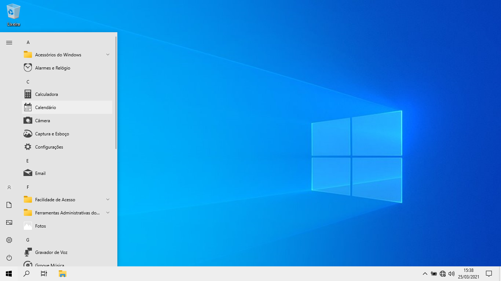

# Script de configuração para Windows 10 x64 20H2

Esse script adequa o Windows 10 para melhor desempenho em máquina de baixo poder de processamento.

## O que o script faz

- Ativação por voz desativada acima da tela de bloqueio
- Desabilita o feed de atividades
- Desativa lembretes na tela de bloqueio
- Desativa rotação de imagens da tela de bloqueio
- Desativa imagem de fundo da tela de bloqueio
- Desativa sugestão de conteúdo
- Desativa transparência
- Desativa animações e sombras do Windows Explorer
- Desabilita o Peek
- Desativa mostrar conteúdo da janela ao arrastar
- Desabilita arquivos recentes e frequentes do Windows Explorer
- Mostra extensão de arquivos no Windows Exploorer
- Desativa aplicativos recentes no Menu Iniciar
- Deixa Menu Iniciar simples sem área de tiles
- Simplifica barra de tarefas
- Aplica horário ativo das 7h as 23h
- Modifica imagem de plano de fundo padrão (caso use `/w`)
- Desativa Windows Defender (caso use `/d`)
- Desabilita horário de verão (caso *não* use `/t`)
- Desativa Windows Update (caso use `/u`)
- Remove aplicativo de Clima
- Remove aplicativo Dicas
- Remove aplicativo Noticias
- Remove aplicativo OneNote
- Remove aplicativo Telefone
- Remove aplicativo Holographic
- Remove aplicativo Print3D
- Remove aplicativo 3DViewer
- Remove aplicativo Skype
- Remove aplicativo Spotify
- Remove aplicativo XBox
- Remove aplicativo CandyCrush
- Remove aplicativo MixedReality
- Remove aplicativo OneConnect
- Remove aplicativo Office
- Remove aplicativo Cortana
- Remove aplicativo Filmes e TV
- Remove aplicativo Onedrive

## Como usar

> Só use este script assim que instalar o Windows. Pois ele poderá remover apps que talvez você utilize como o office.

1. Baixe o repositório `win10-fast_x64`.
1. Abra o terminal do windows `cmd` como Administrador.
1. Navegue até o a pasta do projeto usando: `cd Caminho/Para/Pasta/Do/Projeto`.
1. Execute no comando:
    ```
    silent.bat /w /d /t /u

    Onde:
    /w  Troca o plano de fundo
    /d  Desativa o Windows Defender
    /t  Não desativa o horário de verão
    /u  Desativa o Windows Update
    ```
    
1. Espere o script terminar de executar até liberar novamente o terminal.
1. Reinicie a máquina.

## Captura de Tela



## Tutorial em Vídeo

[](http://www.youtube.com/watch?v=H_uzbKVE8g0)
